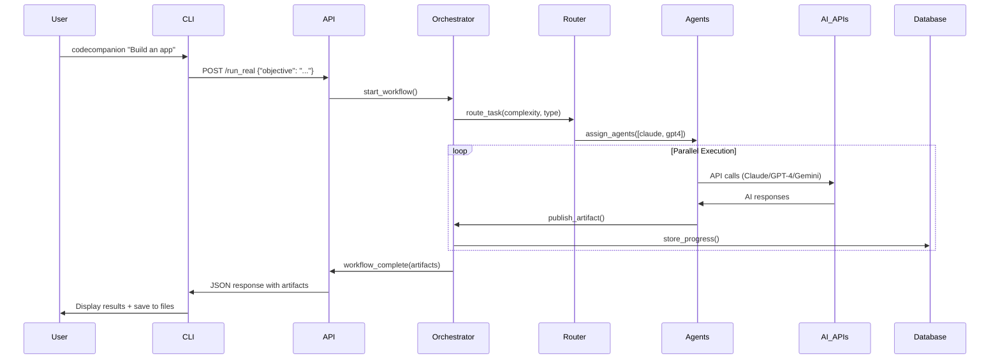
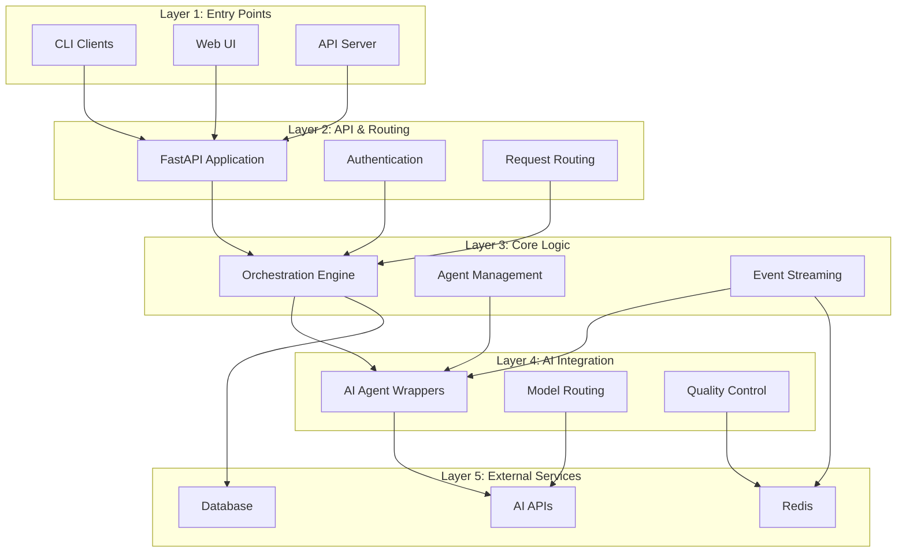

# CodeCompanion Architecture Graph

## High-Level System Overview

```mermaid
graph TB
    subgraph "Entry Points"
        CLI[CLI Client<br/>cli.py]
        WEB[Web UI<br/>app.py<br/>Streamlit]
        API[API Server<br/>server.py<br/>FastAPI:5050]
        CCLI[CodeCompanion CLI<br/>codecompanion/cli.py]
    end

    subgraph "API Layer"
        FASTAPI[FastAPI Application<br/>api.py]
        AUTH[Token Auth<br/>require_token()]
        ENDPOINTS["/health, /keys, /run_real"]
    end

    subgraph "Core Orchestration"
        ORCH[Event-Sourced Orchestrator<br/>core/orchestrator.py]
        LIVE[Live Orchestrator<br/>core/live_orchestrator.py]
        PARALLEL[Parallel Execution<br/>core/parallel_execution.py]
        ROUTER[Intelligent Router<br/>core/intelligent_router.py]
    end

    subgraph "Event System"
        BUS[Event Bus<br/>bus.py<br/>Redis Streams]
        STREAM[Event Streaming<br/>core/event_streaming.py]
    end

    subgraph "AI Agents"
        BASE[Base Agent<br/>agents/base_agent.py]
        CLAUDE[Claude Agent<br/>agents/claude_agent.py]
        GPT4[GPT-4 Agent<br/>agents/gpt4_agent.py]
        GEMINI[Gemini Agent<br/>agents/gemini_agent.py]
        LIVE_AGENTS[Live Agent Workers<br/>agents/live_agent_workers.py]
    end

    subgraph "AI Models (External APIs)"
        ANTHROPIC[Anthropic Claude API]
        OPENAI[OpenAI GPT-4 API]
        GOOGLE[Google Gemini API]
    end

    subgraph "Schema & Artifacts"
        SCHEMAS[Schema Definitions<br/>schemas/]
        ARTIFACTS[Artifact Handler<br/>core/artifacts.py]
        VALIDATOR[Artifact Validator]
    end

    subgraph "Storage & Persistence"
        DB[Database Manager<br/>storage/database_manager.py]
        MEMORY[Vector Store<br/>memory/vector_store.py]
        PERF[Performance Store<br/>storage/performance_store.py]
    end

    subgraph "Configuration & Settings"
        CONFIG[Settings<br/>settings.py]
        STARTUP[Startup Logs<br/>startup_logs.py]
    end

    subgraph "Monitoring & Quality"
        MONITOR[Performance Tracker<br/>monitoring/performance_tracker.py]
        QUALITY[Quality Dashboard<br/>monitoring/quality_dashboard.py]
        COST[Cost Governor<br/>core/cost_governor.py]
    end

    %% Entry Point Connections
    CLI --> API
    WEB --> FASTAPI
    API --> FASTAPI
    CCLI --> ANTHROPIC

    %% API Layer
    FASTAPI --> AUTH
    FASTAPI --> ENDPOINTS
    FASTAPI --> ORCH

    %% Core Orchestration Flow
    ORCH --> BUS
    LIVE --> ORCH
    PARALLEL --> ORCH
    ROUTER --> LIVE_AGENTS

    %% Event System
    BUS --> STREAM
    STREAM --> ORCH

    %% Agent Architecture
    BASE --> CLAUDE
    BASE --> GPT4
    BASE --> GEMINI
    LIVE_AGENTS --> CLAUDE
    LIVE_AGENTS --> GPT4
    LIVE_AGENTS --> GEMINI

    %% External API Connections
    CLAUDE --> ANTHROPIC
    GPT4 --> OPENAI
    GEMINI --> GOOGLE

    %% Data Flow
    ORCH --> ARTIFACTS
    ARTIFACTS --> SCHEMAS
    ARTIFACTS --> VALIDATOR
    ORCH --> DB
    ORCH --> MEMORY

    %% Configuration
    CONFIG --> ORCH
    CONFIG --> FASTAPI
    STARTUP --> CONFIG

    %% Monitoring
    ORCH --> MONITOR
    MONITOR --> QUALITY
    COST --> MONITOR

    style CLI fill:#e1f5fe
    style WEB fill:#e1f5fe
    style API fill:#e1f5fe
    style CCLI fill:#e1f5fe
    style ORCH fill:#f3e5f5
    style BUS fill:#fff3e0
    style CLAUDE fill:#e8f5e8
    style GPT4 fill:#e8f5e8
    style GEMINI fill:#e8f5e8
```

## Data Flow Architecture



## Component Dependencies



## Key System Components

### 1. Entry Points & Interfaces

- **Web UI (app.py)**: Streamlit-based interface with embedded API server
- **CLI Client (cli.py)**: Command-line interface for API interaction
- **API Server (server.py)**: Production FastAPI server on port 5050
- **CodeCompanion CLI**: Standalone tool for direct AI interactions

### 2. Core Orchestration Engine

- **Event-Sourced Orchestrator**: Manages workflow state through immutable events
- **Live Orchestrator**: Coordinates real AI agents with quality cascading
- **Parallel Execution Engine**: Handles concurrent agent operations
- **Intelligent Router**: Routes tasks based on complexity and agent capabilities

### 3. AI Agent Architecture

- **Base Agent**: Abstract interface defining agent contracts
- **Specialized Agents**: Claude, GPT-4, and Gemini implementations
- **Live Agent Workers**: Production agent coordination
- **Agent Capabilities**: Structured capability declarations and routing

### 4. Event & Communication System

- **Redis Event Bus**: Production event streaming with Redis Streams
- **Event Streaming**: Real-time event orchestration and monitoring
- **Schema-Driven Communication**: Structured artifact exchange

### 5. Storage & Persistence

- **Database Manager**: SQLite-based project and performance storage
- **Vector Memory Store**: Vector-based memory and similarity search
- **Performance Store**: Metrics and learning data persistence

### 6. Quality & Monitoring

- **Quality Cascade**: Multi-agent review and validation
- **Performance Tracking**: Real-time performance metrics
- **Cost Governor**: Usage and cost monitoring
- **Consensus Validator**: Multi-agent agreement validation

## Architectural Patterns

### Event Sourcing
- All workflow state changes captured as immutable events
- Full audit trail and replay capability
- Event-driven agent coordination

### Multi-Agent Orchestration
- Specialized agents for different task types
- Intelligent task routing and load balancing
- Quality cascading through agent chains

### Schema-Driven Communication
- Structured artifact definitions (SpecDoc, CodePatch, etc.)
- Type-safe agent input/output contracts
- Validation and quality assurance

### Microservices Architecture
- Separation of concerns (API, UI, Orchestration)
- Independent scaling and deployment
- Service discovery and health monitoring

## Data Flow Patterns

### 1. Request Processing
```
User Input → CLI/Web → API → Orchestrator → Agent Assignment → Parallel Execution → Result Aggregation → Response
```

### 2. Event Streaming
```
Agent Action → Event Publication → Redis Streams → Event Handlers → State Updates → UI Updates
```

### 3. Quality Cascade
```
Primary Agent → Secondary Agent Review → Tertiary Agent Validation → Consensus → Final Artifact
```

### 4. Learning Loop
```
Task Execution → Performance Metrics → Learning Engine → Router Updates → Improved Routing
```

## Configuration & Deployment

### Environment Configuration
- **Development**: Mock event bus, local SQLite, demo mode
- **Production**: Redis Streams, token authentication, performance monitoring
- **API Keys**: Anthropic, OpenAI, Google Gemini integration

### Deployment Options
1. **Standalone**: CodeCompanion CLI with direct API access
2. **Local Development**: Streamlit + embedded API server
3. **Production**: Separate API server (port 5050) + web interface

### Monitoring & Observability
- Real-time performance tracking
- Quality metrics and dashboards
- Cost governance and usage monitoring
- Event stream monitoring and debugging

## Recommendations for Improvement

### 1. Code Cleanup
- Remove backup files (*.bak) and test directories
- Archive applied patch files
- Consolidate duplicate database files

### 2. Performance Optimization  
- Replace demo asyncio.sleep() calls with configurable delays
- Implement connection pooling for AI APIs
- Add caching for repeated agent requests

### 3. Production Readiness
- Implement comprehensive error handling
- Add request rate limiting
- Enhance security with API key rotation
- Add comprehensive logging and monitoring

### 4. Architecture Evolution
- Consider microservices decomposition for scaling
- Implement circuit breakers for external API calls  
- Add distributed tracing for multi-agent workflows
- Consider event sourcing for full system state